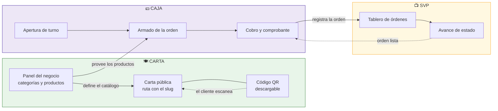
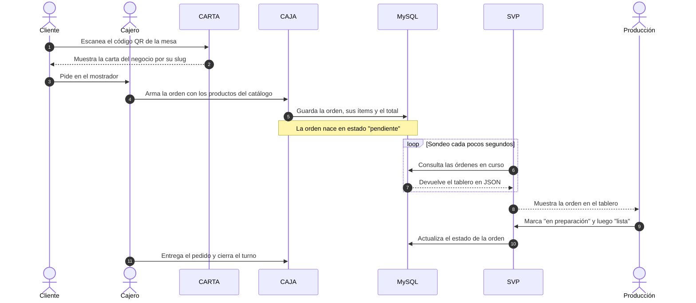
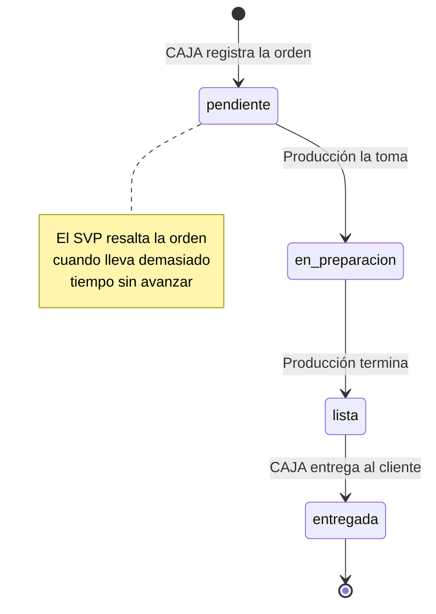
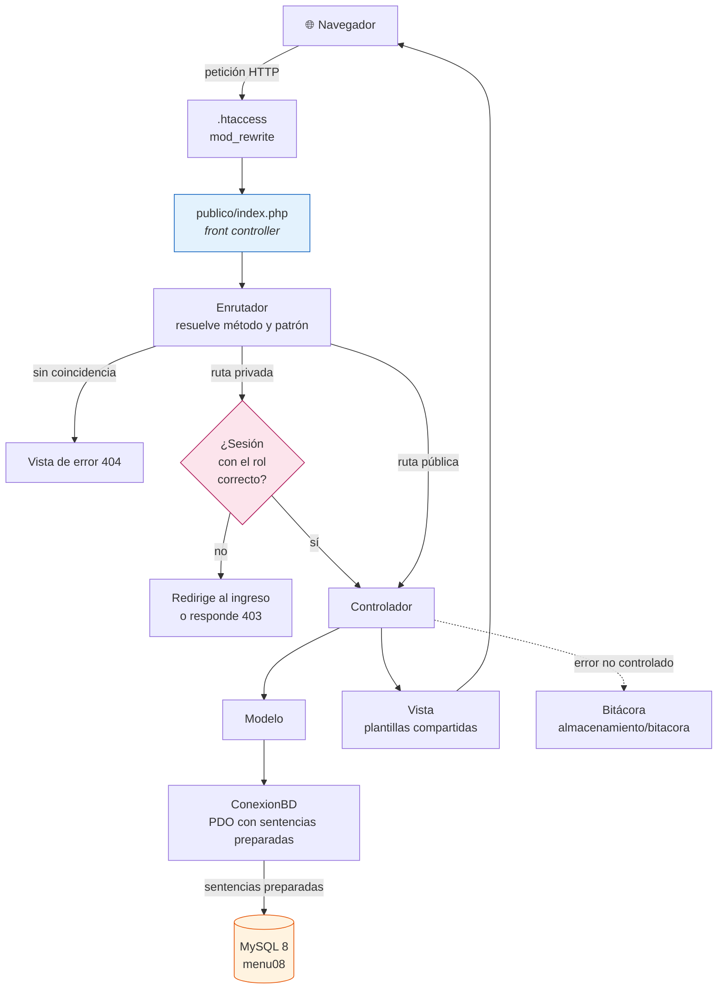
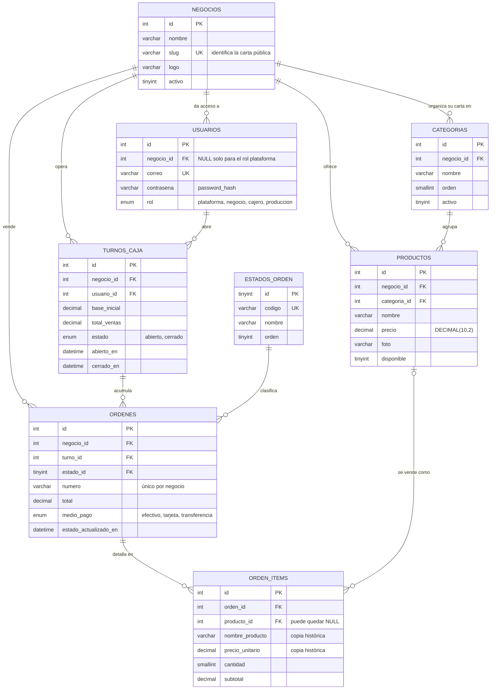
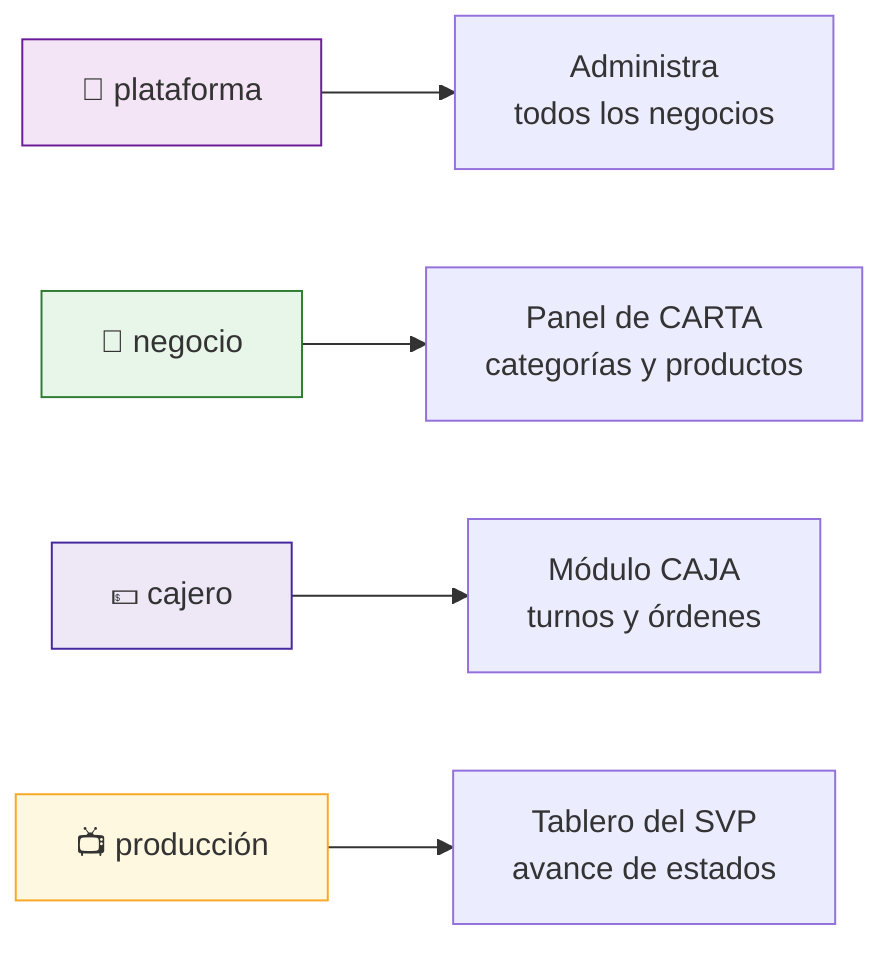
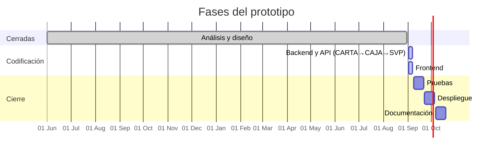

# Menu08

Prototipo funcional de la plataforma **Menu08** para negocios de alimentos:
restaurantes, cafeterías, comidas rápidas y food trucks.

El negocio publica su carta, vende desde caja y la producción ve las órdenes en pantalla.
Tres módulos que comparten un mismo catálogo y una misma base de datos.

| | Módulo | Quién lo usa | Qué resuelve |
|---|---|---|---|
| 🍽️ | **CARTA** | El cliente y el administrador del negocio | Carta digital pública que se abre leyendo un código QR, y el panel donde se administran categorías y productos |
| 💵 | **CAJA** | El cajero | Apertura y cierre de turno, armado de la orden, total, medio de pago y comprobante |
| 📺 | **SVP** | El área de producción | **Sistema de Visualización de Producción**: tablero donde llegan las órdenes de CAJA y avanzan de estado hasta quedar listas |

- Prototipo publicado en **https://adso.menu08.com**
- Proyecto formativo iniciado en **junio de 2025** · Tecnólogo en Análisis y Desarrollo de Software (ADSO), SENA · Ficha 3235887

---

## Cómo encajan los tres módulos

CARTA es la pieza que se construye primero porque es el catálogo del que dependen las otras dos:
sin productos no hay nada que vender en CAJA ni nada que mostrar en el SVP.



## Recorrido de una venta



## Ciclo de vida de la orden



---

## Arquitectura

PHP 8.2 con programación orientada a objetos, patrón **MVC construido a mano**,
sin gestor de dependencias ni marcos de trabajo externos. Una sola puerta de entrada:
`publico/index.php`.



### Estructura de carpetas

```
publico/                    única carpeta expuesta por el servidor web
  index.php                 front controller
  .htaccess                 reescritura hacia el front controller
  recursos/                 css, js e imágenes estáticas
aplicacion/
  nucleo/                   Enrutador, ConexionBD, Controlador, Vista,
                            Sesion, Csrf, Validador, GestorImagenes, GeneradorQr
  controladores/            XxxControlador.php
  modelos/                  Xxx.php
  vistas/
    plantillas/             cabecera, pie y vista de error compartidas
    auth/  panel/  carta/  caja/  svp/
configuracion/
  configuracion.ejemplo.php plantilla versionada
  configuracion.php         credenciales reales — NUNCA se versiona
basedatos/
  esquema.sql               las ocho tablas
  datos_iniciales.sql       estados, negocio y catálogo de demostración
almacenamiento/
  subidas/                  logos, fotos de producto y códigos QR
  bitacora/                 registro de errores
docs/                       documentación del proyecto
```

---

## Modelo de datos

Ocho tablas en MySQL 8, motor InnoDB, cotejamiento `utf8mb4_unicode_ci`.
Todos los montos son `DECIMAL(10,2)`.



`ORDEN_ITEMS` copia el nombre y el precio del producto en el momento de la venta:
si el negocio cambia el precio después, las órdenes ya registradas no se alteran.

El detalle completo está en [`docs/basedatos.md`](docs/basedatos.md).

## Roles y acceso



Cada ruta privada exige sesión iniciada y el rol adecuado. Todo formulario viaja con
token contra falsificación de peticiones, y todas las consultas usan sentencias
preparadas de PDO.

---

## Puesta en marcha

**Requisitos:** PHP 8.2 con las extensiones `pdo_mysql` y `gd`, MySQL 8 o MariaDB 10.6,
y Apache con `mod_rewrite` habilitado.

```bash
git clone git@github.com:Lain-Ramirez/Menu08.git
cd Menu08

# 1. Base de datos — en este orden
mysql -u root -p < basedatos/esquema.sql
mysql -u root -p < basedatos/datos_iniciales.sql

# 2. Configuración
cp configuracion/configuracion.ejemplo.php configuracion/configuracion.php
#    editar credenciales y url_base

# 3. Permisos de escritura
chmod -R 775 almacenamiento/subidas almacenamiento/bitacora
```

Apuntar el *DocumentRoot* del sitio a la carpeta `publico/`. Con el servidor
integrado de PHP, para pruebas rápidas:

```bash
php -S localhost:8000 -t publico
```

| Ruta | Acceso | Módulo |
|---|---|---|
| `/carta/sabor-criollo` | pública | CARTA |
| `/ingresar` | pública | — |
| `/panel` | rol `negocio` o `plataforma` | CARTA |
| `/caja` | rol `cajero` | CAJA |
| `/svp` | rol `produccion` | SVP |

Los usuarios de demostración y sus contraseñas están en
[`docs/basedatos.md`](docs/basedatos.md). **Cambiarlas antes de publicar el sitio.**

---

## Estado del desarrollo

El trabajo se sigue en los [issues](https://github.com/Lain-Ramirez/Menu08/issues)
del repositorio, agrupados por fase.



| Fase | Milestone | Estado |
|---|---|---|
| Análisis | [Fase 1](https://github.com/Lain-Ramirez/Menu08/milestone/1) | Cerrada |
| Diseño (BD y UI) | [Fase 2](https://github.com/Lain-Ramirez/Menu08/milestone/2) | Cerrada |
| Backend y API | [Fase 3](https://github.com/Lain-Ramirez/Menu08/milestone/3) | En curso |
| Frontend | [Fase 4](https://github.com/Lain-Ramirez/Menu08/milestone/4) | En curso |
| Pruebas | [Fase 5](https://github.com/Lain-Ramirez/Menu08/milestone/5) | Pendiente |
| Despliegue | [Fase 6](https://github.com/Lain-Ramirez/Menu08/milestone/6) | Pendiente |
| Documentación | [Fase 7](https://github.com/Lain-Ramirez/Menu08/milestone/7) | Pendiente |

---

## Autoría

Proyecto formativo del Tecnólogo en Análisis y Desarrollo de Software del SENA, ficha 3235887.

- **Jovanny Medina Cifuentes** — [@JovannyCO](https://github.com/JovannyCO)
- **Lain Ramírez** — [@Lain-Ramirez](https://github.com/Lain-Ramirez)
