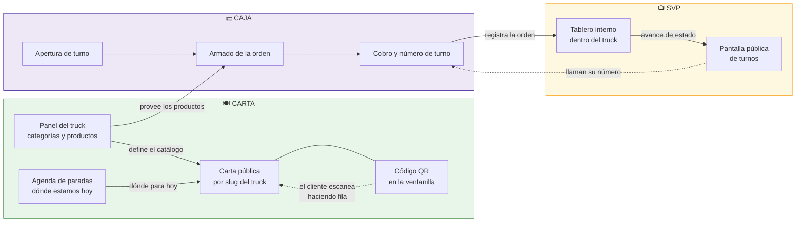
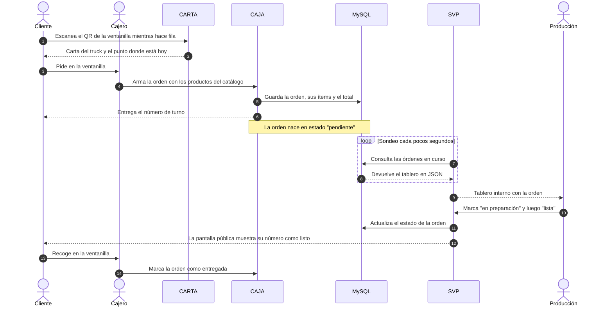
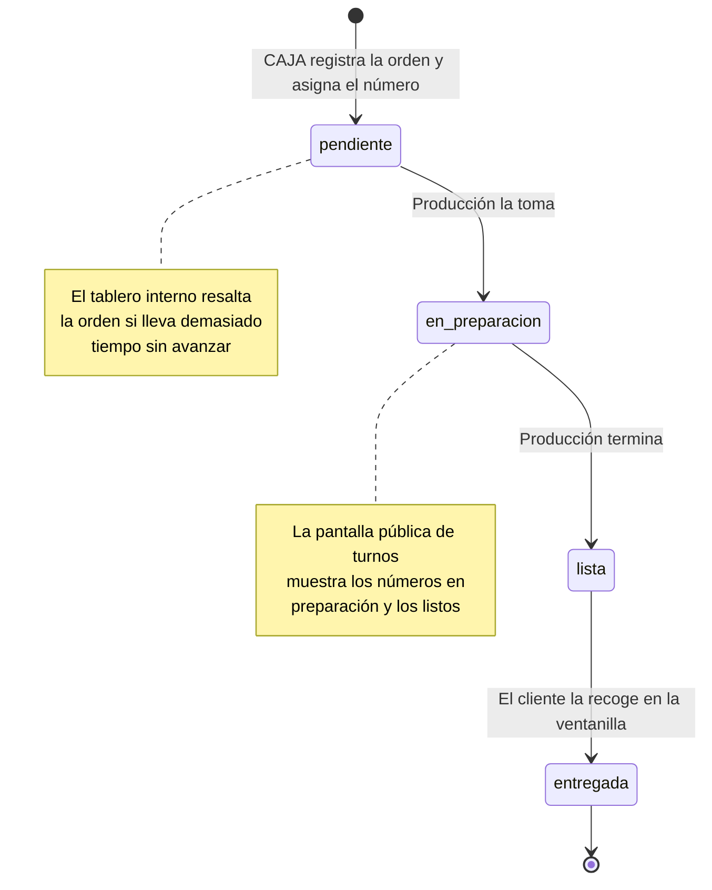
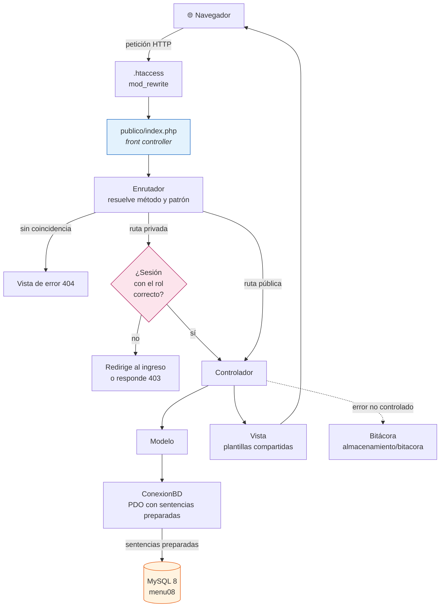
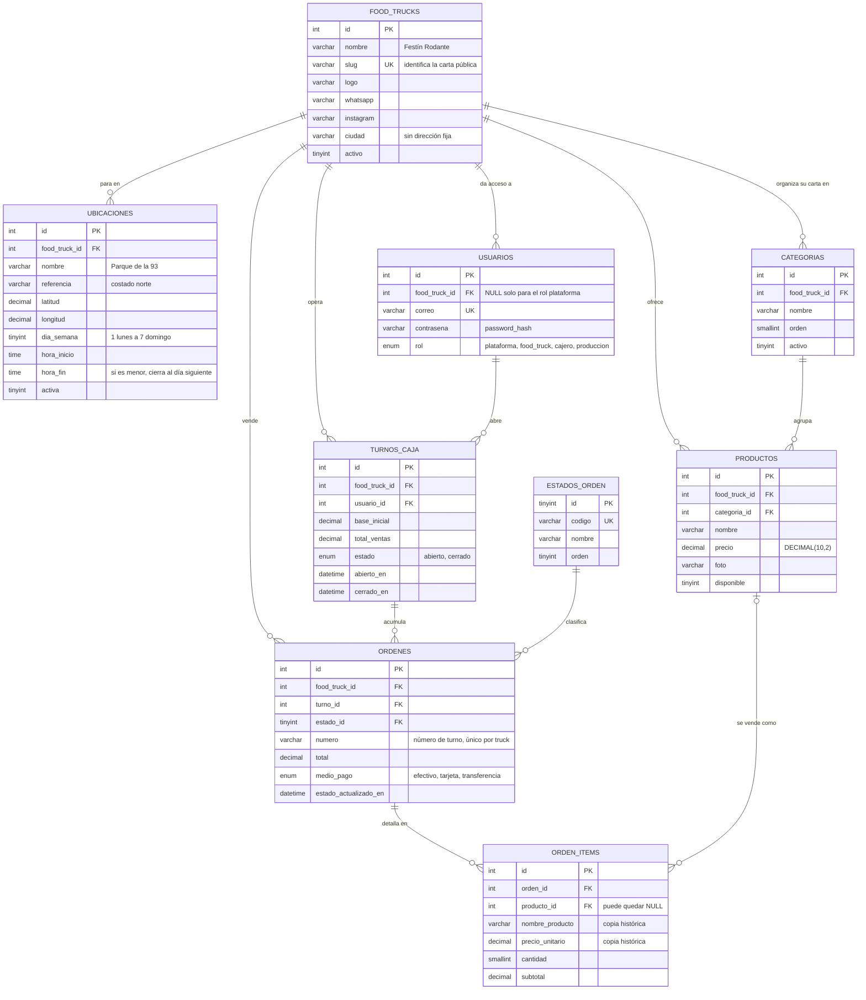
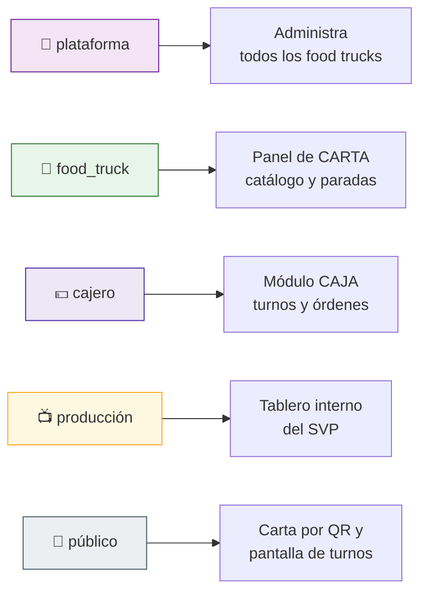
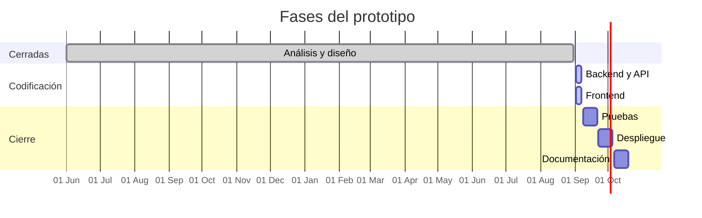

# Menu08

Plataforma de carta digital, venta y producción para **food trucks**.

Un food truck no tiene local ni mesas: tiene una ventanilla, una fila y un punto que
cambia según el día. Menu08 está construido alrededor de eso.

El primer food truck de la plataforma es **Festín Rodante**.

| | Módulo | Quién lo usa | Qué resuelve |
|---|---|---|---|
| 🍽️ | **CARTA** | El cliente en la fila y el administrador del truck | Carta digital que se abre leyendo el QR pegado en la ventanilla, con la agenda de puntos donde para el truck. Y el panel donde se administran categorías, productos y paradas |
| 💵 | **CAJA** | El cajero | Apertura y cierre de turno, armado de la orden, total, medio de pago y **número de turno** para el cliente |
| 📺 | **SVP** | Producción y el cliente | **Sistema de Visualización de Producción**: tablero interno dentro del truck y **pantalla pública de turnos** en la ventanilla |

- Prototipo publicado en **https://adso.menu08.com**
- Proyecto formativo iniciado en **junio de 2025** · Tecnólogo en Análisis y Desarrollo de Software (ADSO), SENA · Ficha 3235887

---

## Cómo encajan los tres módulos

CARTA se construye primero porque es el catálogo del que dependen las otras dos:
sin productos no hay nada que vender en CAJA ni nada que mostrar en el SVP.



## Recorrido de una venta



## Ciclo de vida de la orden



---

## Arquitectura

PHP 8.2 con programación orientada a objetos, patrón **MVC construido a mano**,
sin gestor de dependencias ni marcos de trabajo externos. Una sola puerta de entrada:
`publico/index.php`.



### Estructura de carpetas

El repositorio es un **espejo del servidor**: las dos carpetas de primer nivel se llaman
igual que en el hosting y se copian tal cual, sin traducir nada.

```
menu08_app/                 🔒 privada · se copia a /home/sfacturs2/menu08_app/
  publico/
    index.php               front controller
    .htaccess
  aplicacion/
    nucleo/                 Enrutador, ConexionBD, Controlador, Vista, Sesion,
                            Csrf, Validador, GestorImagenes, GeneradorQr
    controladores/          XxxControlador.php
    modelos/                Xxx.php
    vistas/                 plantillas/ auth/ panel/ carta/ caja/ svp/
  configuracion/
    configuracion.ejemplo.php  plantilla versionada
    configuracion.php          credenciales reales — NUNCA se versiona
    rutas.php                  tabla de rutas
  basedatos/
    esquema.sql             las nueve tablas
    datos_iniciales.sql     estados, food truck y usuarios de demostración
  almacenamiento/
    bitacora/               registro de errores

ADSO.menu08.com/            🌐 pública · se copia a /home/sfacturs2/ADSO.menu08.com/
  index.php                 puente hacia menu08_app/publico/index.php
  .htaccess                 reescritura y cabeceras de seguridad
  recursos/                 css, js e imágenes
  subidas/                  logos, fotos de producto y códigos QR

docs/                       documentación del proyecto
```

**Nada sensible vive en la carpeta pública.** La configuración con las credenciales, los
scripts de la base de datos y el código de la aplicación quedan fuera del alcance del
servidor web por estructura, no por una regla de `.htaccess` que alguien pueda desactivar.
Ver [`docs/despliegue.md`](docs/despliegue.md).

---

## Modelo de datos

Nueve tablas en MySQL 8, motor InnoDB, cotejamiento `utf8mb4_unicode_ci`.
Todos los montos son `DECIMAL(10,2)`.



Dos decisiones de modelo que vienen de trabajar con food trucks y no con locales:

- **`UBICACIONES` en vez de una dirección.** El truck para en sitios distintos según el
  día. Cada fila es una parada programada, y la carta pública responde con ellas la
  pregunta *¿dónde están hoy?*. Una jornada nocturna cruza la medianoche: cuando
  `hora_fin` es menor o igual que `hora_inicio`, la jornada cierra al día siguiente.
- **`ORDEN_ITEMS` copia el nombre y el precio** del producto en el momento de la venta.
  Si el truck cambia el precio después, las órdenes ya registradas no se alteran.

El detalle completo está en [`docs/basedatos.md`](docs/basedatos.md).

## Roles y acceso



Cada ruta privada exige sesión iniciada y el rol adecuado. Todo formulario viaja con
token contra falsificación de peticiones, y todas las consultas usan sentencias
preparadas de PDO.

---

## Puesta en marcha

**Requisitos:** PHP 8.2 con las extensiones `pdo_mysql` y `gd`, MySQL 8 o MariaDB 10.6,
y Apache con `mod_rewrite` habilitado.

```bash
git clone git@github.com:Lain-Ramirez/Menu08.git
cd Menu08

# 1. Base de datos — en este orden
mysql -u root -p < basedatos/esquema.sql
mysql -u root -p < basedatos/datos_iniciales.sql

# 2. Configuración
cp configuracion/configuracion.ejemplo.php configuracion/configuracion.php
#    editar credenciales y url_base

# 3. Permisos de escritura
chmod -R 775 almacenamiento/subidas almacenamiento/bitacora
```

Apuntar el *DocumentRoot* del sitio a la carpeta `ADSO.menu08.com/`. Con el servidor
integrado de PHP, para pruebas rápidas — el último argumento es el front controller,
sin él las rutas no se resuelven:

```bash
php -S localhost:8000 -t ADSO.menu08.com ADSO.menu08.com/index.php
```

| Ruta | Acceso | Módulo |
|---|---|---|
| `/carta/festin-rodante` | pública | CARTA |
| `/turnos/festin-rodante` | pública, pantalla de la ventanilla | SVP |
| `/ingresar` | pública | — |
| `/panel` | rol `food_truck` o `plataforma` | CARTA |
| `/caja` | rol `cajero` | CAJA |
| `/svp` | rol `produccion` o `food_truck` | SVP |
| `/svp/ordenes` | rol `produccion` o `food_truck`, responde JSON | SVP |

Los usuarios de demostración y sus contraseñas están en
[`docs/basedatos.md`](docs/basedatos.md). **Cambiarlas antes de publicar el sitio.**

El contrato del servicio JSON que sondea el tablero está en
[`docs/api-svp.md`](docs/api-svp.md).

---

## Estado del desarrollo

El trabajo se sigue en los [issues](https://github.com/Lain-Ramirez/Menu08/issues)
del repositorio, agrupados por fase.



| Fase | Milestone | Estado |
|---|---|---|
| Análisis | [Fase 1](https://github.com/Lain-Ramirez/Menu08/milestone/1) | Cerrada |
| Diseño (BD y UI) | [Fase 2](https://github.com/Lain-Ramirez/Menu08/milestone/2) | Cerrada |
| Backend y API | [Fase 3](https://github.com/Lain-Ramirez/Menu08/milestone/3) | En curso |
| Frontend | [Fase 4](https://github.com/Lain-Ramirez/Menu08/milestone/4) | En curso |
| Pruebas | [Fase 5](https://github.com/Lain-Ramirez/Menu08/milestone/5) | Pendiente |
| Despliegue | [Fase 6](https://github.com/Lain-Ramirez/Menu08/milestone/6) | Pendiente |
| Documentación | [Fase 7](https://github.com/Lain-Ramirez/Menu08/milestone/7) | Pendiente |

---

## Autoría

Proyecto formativo del Tecnólogo en Análisis y Desarrollo de Software del SENA, ficha 3235887.

- **Jovanny Medina Cifuentes** — [@JovannyCO](https://github.com/JovannyCO)
- **Lain Ramírez** — [@Lain-Ramirez](https://github.com/Lain-Ramirez)
