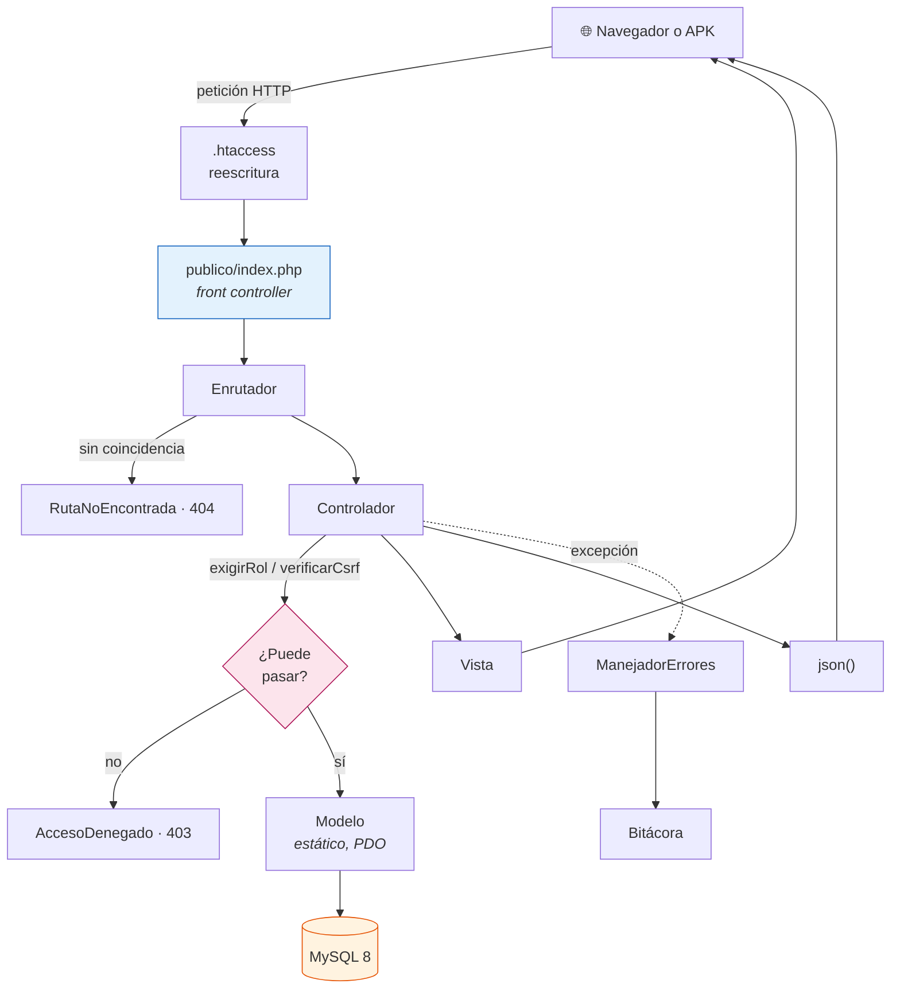
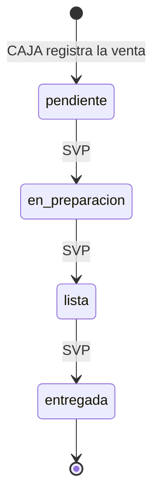

# Arquitectura

PHP 8.3 con programación orientada a objetos y un **MVC escrito a mano**: sin Composer, sin marcos
de trabajo y sin paquetes de terceros. La restricción es del proyecto formativo, y tiene una
consecuencia buena: aquí no hay magia que explicar, todo lo que ocurre entre la petición y la
respuesta está en unas pocas clases que caben en la cabeza.

Este documento describe **cómo está construido** el prototipo. El modelo de datos que consume está
en [`modelo_datos.md`](modelo_datos.md); cómo se trabaja con el núcleo en el día a día —agregar una
ruta, provocar un error, comprobar que responde— en [`nucleo.md`](nucleo.md).

## Las capas



**Una sola puerta de entrada.** `ADSO.menu08.com/.htaccess` manda a `publico/index.php` toda
petición que no corresponda a un archivo existente. No hay ningún otro `.php` alcanzable desde la
web: el código de la aplicación vive en `menu08_app/`, fuera de la raíz del sitio, y ahí no llega
ninguna petición. La separación es estructural, no una regla de `.htaccess` que alguien pueda
desactivar.

## El recorrido de una petición, de extremo a extremo

Se sigue una ruta real: **`GET /panel/categorias/4`**, la pantalla de edición de una categoría.

**1 · El front controller.** `publico/index.php` prepara el terreno, siempre en este orden:

```
1. autocarga por convención        tres espacios de nombres, tres carpetas
2. ManejadorErrores::registrar()   desde aquí ningún fallo se pierde
3. Configuracion::cargar()         lee configuracion/configuracion.php
4. Sesion::iniciar()               cookie endurecida y caducidad por inactividad
5. require configuracion/rutas.php registra todas las rutas
6. Enrutador::despachar()
```

El manejador de errores se registra **antes** que nada de lo demás, para que un fallo al leer la
configuración también salga por el camino previsto en vez de vaciarse en la pantalla.

**2 · La autocarga.** No hay gestor de dependencias: una función de veinte líneas traduce el nombre
de la clase a una ruta de archivo. Solo conoce tres espacios de nombres:

| Espacio de nombres | Carpeta |
|---|---|
| `Menu08\Nucleo\` | `aplicacion/nucleo/` |
| `Menu08\Controladores\` | `aplicacion/controladores/` |
| `Menu08\Modelos\` | `aplicacion/modelos/` |

Las **vistas no tienen espacio de nombres**: son archivos PHP que `Vista` incluye con las variables
ya extraídas, así que dentro de una vista las claves del arreglo son variables sueltas.

**3 · El enrutador.** `configuracion/rutas.php` registró antes esta línea:

```php
$enrutador->get('/panel/categorias/{id:\d+}', [CategoriaControlador::class, 'editar']);
```

`Enrutador::despachar()` compara método y patrón. El `{id:\d+}` captura el `4` y lo pasa al método
**como cadena**, aunque el patrón exija dígitos: la conversión a entero es cosa del controlador. Sin
coincidencia lanza `RutaNoEncontrada`.

**4 · El controlador.** Acceso primero, CSRF después, y el food truck **siempre de la sesión**:

```php
public function editar(string $id): void
{
    $this->exigirRol('food_truck');

    $ft        = $this->foodTruckActual();
    $categoria = Categoria::porId((int) $id, $ft);

    if ($categoria === null) {
        throw new RutaNoEncontrada(...);   // 404, no 403
    }

    $this->vista('panel/categorias', [...], 'Editar categoria');
}
```

**5 · El modelo.** Métodos estáticos, sentencias preparadas y el `food_truck_id` dentro del `WHERE`.
Nunca concatena un valor recibido por `$_GET` o `$_POST`.

**6 · La vista.** `Vista::pagina()` renderiza la plantilla dentro del marco común y devuelve el
HTML. Todo lo que sale se escapa con `Vista::e()`; lo único que la plantilla base imprime sin
escapar es `$contenido`, que ya viene renderizado por su propia vista.

## Qué hace cada clase del núcleo

Todas en `menu08_app/aplicacion/nucleo/`.

| Clase | Responsabilidad |
|---|---|
| **`Enrutador`** | Registra rutas por método y patrón, y resuelve la petición al par controlador–método. Los parámetros `{id:\d+}` llegan como cadena |
| **`Controlador`** | Base de todos los controladores. Aporta las respuestas —`vista()`, `json()`, `redirigir()`, `jsonError()`— y las puertas de acceso: `exigirRol()`, `exigirRolApi()`, `verificarCsrf()`, `verificarCsrfApi()` y `foodTruckActual()` |
| **`Vista`** | Renderiza plantillas y escapa la salida con `Vista::e()`. `Vista::url()` construye enlaces respetando `url_base`, para que la aplicación funcione en una subcarpeta |
| **`ConexionBD`** | Una sola instancia de PDO para toda la petición. Modo de error por excepción, obtención asociativa y **sin emulación de sentencias preparadas** |
| **`Sesion`** | Cookie endurecida (`HttpOnly`, `SameSite=Lax`, `Secure` según entorno), renovación del identificador al autenticar y caducidad por inactividad |
| **`Csrf`** | Token por sesión con vencimiento a 120 minutos, comparado con `hash_equals`. `campo()` lo inserta en el formulario; `rotar()` lo invalida tras una operación sensible |
| **`Validador`** | Toda la validación de entrada en un solo sitio: `texto()`, `precio()`, `entero()`, `diaSemana()`, `hora()`, `coordenada()`. Acumula errores por campo y devuelve los valores ya limpios |
| **`ManejadorErrores`** | Convierte cualquier fallo en una respuesta: página de error en HTML, u objeto JSON si el servicio lo pidió con `responderEnJson()`. En producción el detalle va a la bitácora, nunca al visitante |
| **`Bitacora`** | Registro de errores y avisos en `almacenamiento/bitacora/`, fuera de la raíz web |

Además, dos piezas de apoyo: **`GestorImagenes`** para las subidas de fotos y **`GeneradorQr`**, que
dibuja el código QR de la carta sin ninguna biblioteca externa.

## El árbol de directorios

```
menu08_app/                 🔒 privada, fuera de toda raíz web
  publico/index.php         front controller, la única puerta
  aplicacion/
    nucleo/                 las clases de la tabla de arriba
    controladores/          XxxControlador.php, uno por área
    modelos/                Xxx.php, estáticos y sobre PDO
    vistas/
      plantillas/           marco común, navegación, formularios, error
      auth/                 ingreso
      panel/                administración: food truck, categorías, productos, paradas
      carta/                la carta pública que abre el cliente con el QR
      caja/                 venta, turno y comprobante
      svp/                  tablero de producción y pantalla de turnos
  configuracion/            rutas.php y la configuración (no versionada)
  basedatos/                esquema.sql y datos_iniciales.sql
  pruebas/                  ejecutor de pruebas unitarias y sus casos
  almacenamiento/bitacora/  registro de errores

ADSO.menu08.com/            🌐 pública, es la raíz del sitio
  index.php                 puente hacia publico/index.php
  recursos/                 css, js e imágenes
  subidas/                  logos, fotos de producto y códigos QR
```

Un controlador por área y un modelo por tabla principal. Las vistas se agrupan por módulo, y
`plantillas/` guarda lo que comparten todas.

## La máquina de estados de la orden

El ciclo de vida **solo avanza**. Una orden entregada salió por la ventanilla y no vuelve a la
plancha:



Las transiciones válidas viven **en un único sitio**, `Orden::TRANSICIONES`, y son exactamente
tres:

| Desde | Hacia | Quién puede provocarla |
|---|---|---|
| — | `pendiente` | `POST /caja/vender` · roles `cajero` y `food_truck` |
| `pendiente` | `en_preparacion` | `POST /svp/orden/{id}/estado` · roles `produccion` y `food_truck` |
| `en_preparacion` | `lista` | ídem |
| `lista` | `entregada` | ídem |

**El rol `food_truck` aparece en las dos columnas** porque es el dueño: puede vender y puede mover
la producción. El `cajero` solo vende y el rol `produccion` solo avanza.

Lo que el sistema **rechaza**, siempre con `422 transicion_invalida` y sin tocar la orden:

- Saltarse un paso, como ir de `pendiente` a `entregada`.
- Retroceder, como volver de `lista` a `pendiente`.
- Mover una orden ya `entregada`, que no admite más cambios.
- Un estado que no existe.

La comprobación se hace **dentro de la misma transacción** que haría la actualización, con la fila
bloqueada, así que dos pantallas del tablero pulsando a la vez no pueden colarla dos casillas. El
controlador no repite la tabla de transiciones: solo traduce las negativas del modelo al código HTTP
que les toca.

Cada estado deja su marca de tiempo en **su propia columna** —`creado_en`, `en_preparacion_en`,
`lista_en`, `entregada_en`— en vez de pisar una sola. Por eso «¿cuánto tardó esta orden?» sigue
teniendo respuesta después de entregarla.

## Prácticas de calidad aplicadas

**Sentencias preparadas en todas las consultas.** `ConexionBD` crea el PDO con
`ATTR_EMULATE_PREPARES => false`, así que las preparadas son reales del servidor y no una simulación
del cliente. Ningún modelo concatena un valor recibido por `$_GET` o `$_POST`. Tiene un efecto
lateral que conviene conocer: **un marcador nombrado solo puede aparecer una vez por sentencia**, y
por eso `Ubicacion::vigente()` resuelve el instante en una tabla derivada y su copia bloqueante usa
siete marcadores distintos para el mismo valor.

**Validación centralizada.** Toda entrada pasa por `Validador`, que acumula los errores por campo y
devuelve los valores ya limpios. Ningún controlador valida por su cuenta, así que la regla de qué es
una hora o una coordenada válida está escrita una sola vez. Sus reglas puras tienen pruebas
unitarias en `menu08_app/pruebas/`.

**Token contra falsificación de peticiones en todo POST que modifique datos.** `Csrf` lo genera por
sesión con vencimiento a 120 minutos y lo compara con `hash_equals`, que tarda lo mismo acierte o
falle. Los formularios lo insertan con `Csrf::campo()`; los servicios JSON lo comprueban con
`verificarCsrfApi()` y responden `403 token_invalido` en vez de una página de error.

**El `food_truck_id` sale siempre de la sesión, nunca de la petición.** Es el filtro de toda
consulta: nadie administra el catálogo de otro cambiando un número en la URL. Y un identificador de
otro food truck se trata como **inexistente**, con 404 y no con 403 — un 403 confirmaría que existe.

**El dinero se acumula en centavos, con enteros**, y solo se formatea al final. En coma flotante,
una jornada de decenas de ventas descuadra la caja por unos pesos. Los precios se releen de
`productos` dentro de la misma transacción que escribe la venta: lo que el formulario diga sobre el
importe se descarta.

**Los errores se lanzan, no se maquetan.** Un controlador no construye respuestas de error a mano:
lanza la excepción y `ManejadorErrores` hace el resto, incluida la bitácora.

| Excepción | Código |
|---|---|
| `RutaNoEncontrada` | 404 |
| `AccesoDenegado` | 403 |
| `DatosInvalidos` | 422 |
| cualquier otra | 500, con el detalle en la bitácora y nunca en la pantalla |

En los **servicios JSON** es al revés: la excepción se atrapa en el controlador y se traduce con
`jsonError()`, para que el cuerpo lleve el motivo y no un `fallo_interno` genérico. Un cliente que
espera un objeto y recibe `<!doctype html>` falla con un error de sintaxis que no dice nada del
problema real.

**Toda salida se escapa.** `Vista::e()` en cada valor que llega a una plantilla, sin excepción.
