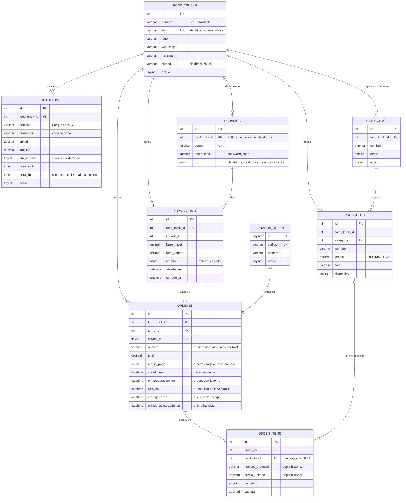

# Modelo de datos

Las **nueve tablas** del prototipo en MySQL 8, motor InnoDB y cotejamiento
`utf8mb4_unicode_ci`. Todos los montos son `DECIMAL(10,2)`.

Este documento es el **diccionario de datos**: qué guarda cada columna, de qué tipo, si admite
nulos y a dónde apunta. La fuente de verdad es
[`menu08_app/basedatos/esquema.sql`](../menu08_app/basedatos/esquema.sql), y las tablas de abajo se
generaron leyéndolo, no transcribiéndolo a mano.

El **porqué** de cada decisión —por qué existe `ubicaciones`, por qué `orden_items` copia el precio,
cómo se reconstruye la base y cómo se respalda— está en
[`basedatos.md`](basedatos.md). Aquí está el *qué*.
La arquitectura que consume estas tablas, en [`arquitectura.md`](arquitectura.md).

## Diagrama entidad-relación

Las relaciones se leen así: un food truck **para en** muchas ubicaciones, **ofrece** muchos
productos y **vende** muchas órdenes; una orden **se detalla en** muchos ítems. La única relación
opcional en los dos extremos es `PRODUCTOS |o--o{ ORDEN_ITEMS`: un ítem puede quedarse sin producto
—si se borra— y conservar igualmente el nombre y el precio con que se vendió.

## Diccionario de datos

### `food_trucks`

| Columna | Tipo | Nulo | Por omisión | Notas |
|---|---|---|---|---|
| `id` | `INT UNSIGNED` | no | — | llave primaria, autonumérica |
| `nombre` | `VARCHAR(120)` | no | — | — |
| `slug` | `VARCHAR(80)` | no | — | minusculas, guiones, sin acentos |
| `descripcion` | `VARCHAR(500)` | **sí** | — | — |
| `logo` | `VARCHAR(160)` | **sí** | — | nombre del archivo en almacenamiento/subidas |
| `telefono` | `VARCHAR(40)` | **sí** | — | — |
| `whatsapp` | `VARCHAR(40)` | **sí** | — | — |
| `instagram` | `VARCHAR(80)` | **sí** | — | — |
| `ciudad` | `VARCHAR(80)` | **sí** | — | ciudad donde opera el food truck |
| `activo` | `TINYINT(1)` | no | `1` | — |
| `creado_en` | `DATETIME` | no | `CURRENT_TIMESTAMP` | — |
| `actualizado_en` | `DATETIME` | no | `CURRENT_TIMESTAMP` | — |

Índices y restricciones:

- `UNIQUE KEY uq_food_trucks_slug (slug)`
- `KEY ix_food_trucks_activo (activo)`

### `ubicaciones`

| Columna | Tipo | Nulo | Por omisión | Notas |
|---|---|---|---|---|
| `id` | `INT UNSIGNED` | no | — | llave primaria, autonumérica |
| `food_truck_id` | `INT UNSIGNED` | no | — | → `food_trucks.id`, `ON DELETE RESTRICT` |
| `nombre` | `VARCHAR(120)` | no | — | como lo conoce la gente: Parque de la 93 |
| `referencia` | `VARCHAR(200)` | **sí** | — | costado norte, frente al centro comercial |
| `latitud` | `DECIMAL(10,7)` | **sí** | — | — |
| `longitud` | `DECIMAL(10,7)` | **sí** | — | — |
| `dia_semana` | `TINYINT UNSIGNED` | no | — | 1 lunes ... 7 domingo |
| `hora_inicio` | `TIME` | no | — | — |
| `hora_fin` | `TIME` | no | — | si es <= hora_inicio, la jornada cierra al dia siguiente |
| `activa` | `TINYINT(1)` | no | `1` | — |
| `creado_en` | `DATETIME` | no | `CURRENT_TIMESTAMP` | — |
| `actualizado_en` | `DATETIME` | no | `CURRENT_TIMESTAMP` | — |

Índices y restricciones:

- `KEY ix_ubicaciones_agenda (food_truck_id, dia_semana, activa)`
- `CONSTRAINT ck_ubicaciones_dia CHECK (dia_semana BETWEEN 1 AND 7)`

### `usuarios`

| Columna | Tipo | Nulo | Por omisión | Notas |
|---|---|---|---|---|
| `id` | `INT UNSIGNED` | no | — | llave primaria, autonumérica |
| `food_truck_id` | `INT UNSIGNED` | **sí** | — | → `food_trucks.id`, `ON DELETE RESTRICT` |
| `nombre` | `VARCHAR(120)` | no | — | — |
| `correo` | `VARCHAR(160)` | no | — | — |
| `contrasena` | `VARCHAR(255)` | no | — | resultado de password_hash, nunca texto plano |
| `rol` | `ENUM('plataforma','food_truck','cajero','produccion')` | no | — | — |
| `activo` | `TINYINT(1)` | no | `1` | — |
| `ultimo_ingreso` | `DATETIME` | **sí** | — | — |
| `creado_en` | `DATETIME` | no | `CURRENT_TIMESTAMP` | — |
| `actualizado_en` | `DATETIME` | no | `CURRENT_TIMESTAMP` | — |

Índices y restricciones:

- `UNIQUE KEY uq_usuarios_correo (correo)`
- `KEY ix_usuarios_food_truck (food_truck_id)`

### `categorias`

| Columna | Tipo | Nulo | Por omisión | Notas |
|---|---|---|---|---|
| `id` | `INT UNSIGNED` | no | — | llave primaria, autonumérica |
| `food_truck_id` | `INT UNSIGNED` | no | — | → `food_trucks.id`, `ON DELETE RESTRICT` |
| `nombre` | `VARCHAR(90)` | no | — | — |
| `orden` | `SMALLINT UNSIGNED` | no | `0` | orden de aparicion en la carta |
| `activo` | `TINYINT(1)` | no | `1` | — |
| `creado_en` | `DATETIME` | no | `CURRENT_TIMESTAMP` | — |
| `actualizado_en` | `DATETIME` | no | `CURRENT_TIMESTAMP` | — |

Índices y restricciones:

- `UNIQUE KEY uq_categorias_food_truck_nombre (food_truck_id, nombre)`
- `KEY ix_categorias_orden (food_truck_id, orden)`

### `productos`

| Columna | Tipo | Nulo | Por omisión | Notas |
|---|---|---|---|---|
| `id` | `INT UNSIGNED` | no | — | llave primaria, autonumérica |
| `food_truck_id` | `INT UNSIGNED` | no | — | → `food_trucks.id`, `ON DELETE RESTRICT` |
| `categoria_id` | `INT UNSIGNED` | no | — | → `categorias.id`, `ON DELETE RESTRICT` |
| `nombre` | `VARCHAR(120)` | no | — | — |
| `descripcion` | `VARCHAR(400)` | **sí** | — | — |
| `precio` | `DECIMAL(10,2)` | no | — | — |
| `foto` | `VARCHAR(160)` | **sí** | — | nombre del archivo en almacenamiento/subidas |
| `disponible` | `TINYINT(1)` | no | `1` | — |
| `orden` | `SMALLINT UNSIGNED` | no | `0` | — |
| `creado_en` | `DATETIME` | no | `CURRENT_TIMESTAMP` | — |
| `actualizado_en` | `DATETIME` | no | `CURRENT_TIMESTAMP` | — |

Índices y restricciones:

- `UNIQUE KEY uq_productos_categoria_nombre (categoria_id, nombre)`
- `KEY ix_productos_food_truck (food_truck_id)`
- `KEY ix_productos_disponible (food_truck_id, disponible)`
- `CONSTRAINT ck_productos_precio CHECK (precio >= 0)`

### `estados_orden`

| Columna | Tipo | Nulo | Por omisión | Notas |
|---|---|---|---|---|
| `id` | `TINYINT UNSIGNED` | no | — | llave primaria, autonumérica |
| `codigo` | `VARCHAR(30)` | no | — | identificador estable usado por el codigo |
| `nombre` | `VARCHAR(40)` | no | — | texto mostrado en pantalla |
| `orden` | `TINYINT UNSIGNED` | no | `0` | — |

Índices y restricciones:

- `UNIQUE KEY uq_estados_orden_codigo (codigo)`

### `turnos_caja`

| Columna | Tipo | Nulo | Por omisión | Notas |
|---|---|---|---|---|
| `id` | `INT UNSIGNED` | no | — | llave primaria, autonumérica |
| `food_truck_id` | `INT UNSIGNED` | no | — | → `food_trucks.id`, `ON DELETE RESTRICT` |
| `usuario_id` | `INT UNSIGNED` | no | — | → `usuarios.id`, `ON DELETE RESTRICT` · cajero que abrio el turno |
| `base_inicial` | `DECIMAL(10,2)` | no | `0` | — |
| `total_ventas` | `DECIMAL(10,2)` | no | `0` | — |
| `total_declarado` | `DECIMAL(10,2)` | **sí** | — | conteo fisico al cerrar |
| `diferencia` | `DECIMAL(10,2)` | **sí** | — | total_declarado - (base_inicial + total_ventas) |
| `estado` | `ENUM('abierto','cerrado')` | no | `'abierto'` | — |
| `abierto_en` | `DATETIME` | no | `CURRENT_TIMESTAMP` | — |
| `cerrado_en` | `DATETIME` | **sí** | — | — |

Índices y restricciones:

- `KEY ix_turnos_food_truck_estado (food_truck_id, estado)`
- `KEY ix_turnos_usuario (usuario_id)`

### `ordenes`

| Columna | Tipo | Nulo | Por omisión | Notas |
|---|---|---|---|---|
| `id` | `INT UNSIGNED` | no | — | llave primaria, autonumérica |
| `food_truck_id` | `INT UNSIGNED` | no | — | → `food_trucks.id`, `ON DELETE RESTRICT` |
| `turno_id` | `INT UNSIGNED` | no | — | → `turnos_caja.id`, `ON DELETE RESTRICT` |
| `estado_id` | `TINYINT UNSIGNED` | no | — | → `estados_orden.id`, `ON DELETE RESTRICT` |
| `numero` | `VARCHAR(20)` | no | — | consecutivo visible, unico por food truck |
| `total` | `DECIMAL(10,2)` | no | `0` | — |
| `medio_pago` | `ENUM('efectivo','tarjeta','transferencia')` | no | `'efectivo'` | — |
| `nota` | `VARCHAR(300)` | **sí** | — | — |
| `creado_en` | `DATETIME` | no | `CURRENT_TIMESTAMP` | nace pendiente |
| `en_preparacion_en` | `DATETIME` | **sí** | — | produccion la tomo |
| `lista_en` | `DATETIME` | **sí** | — | quedo lista en la ventanilla |
| `entregada_en` | `DATETIME` | **sí** | — | el cliente la recogio |
| `estado_actualizado_en` | `DATETIME` | no | `CURRENT_TIMESTAMP` | ultima transicion, sea cual sea |

Índices y restricciones:

- `UNIQUE KEY uq_ordenes_food_truck_numero (food_truck_id, numero)`
- `KEY ix_ordenes_turno (turno_id)`
- `KEY ix_ordenes_tablero (food_truck_id, estado_id, creado_en) COMMENT 'consulta del SVP'`
- `CONSTRAINT ck_ordenes_total CHECK (total >= 0)`

### `orden_items`

| Columna | Tipo | Nulo | Por omisión | Notas |
|---|---|---|---|---|
| `id` | `INT UNSIGNED` | no | — | llave primaria, autonumérica |
| `orden_id` | `INT UNSIGNED` | no | — | → `ordenes.id`, `ON DELETE CASCADE` |
| `producto_id` | `INT UNSIGNED` | **sí** | — | → `productos.id`, `ON DELETE SET NULL` · referencia informativa, puede quedar en NULL |
| `nombre_producto` | `VARCHAR(120)` | no | — | copia historica del nombre |
| `precio_unitario` | `DECIMAL(10,2)` | no | — | copia historica del precio |
| `cantidad` | `SMALLINT UNSIGNED` | no | `1` | — |
| `subtotal` | `DECIMAL(10,2)` | no | — | — |

Índices y restricciones:

- `KEY ix_orden_items_orden (orden_id)`
- `KEY ix_orden_items_producto (producto_id)`
- `CONSTRAINT ck_orden_items_cantidad CHECK (cantidad > 0)`
- `CONSTRAINT ck_orden_items_subtotal CHECK (subtotal >= 0)`

---

## Verificación contra el esquema

El criterio de este documento es que **cada tabla y cada campo coincida** con
[`esquema.sql`](../menu08_app/basedatos/esquema.sql). Se cumple por construcción: las tablas del
diccionario **se generan leyendo el propio DDL**, extrayendo el nombre, el tipo, la nulidad, el
valor por omisión, el comentario y la llave foránea con su acción de borrado. No hay transcripción
a mano, así que no puede haber un error de copia.

Resultado del contraste, sobre las nueve tablas:

| Comprobación | Resultado |
|---|---|
| Tablas en el esquema | **9** |
| Columnas documentadas | **86**, todas las del esquema |
| Entidades del diagrama sin tabla | ninguna |
| Tablas sin entidad en el diagrama | ninguna |
| Atributos del diagrama que no existen como columna | ninguno |
| Acciones de borrado | 10 `RESTRICT`, 1 `CASCADE`, 1 `SET NULL` |

Las tres acciones de borrado coinciden con lo que declara la cabecera del esquema: todo apunta a
`food_trucks` con `RESTRICT` para evitar cascadas cruzadas, y las dos únicas excepciones salen de
`orden_items` —en cascada desde `ordenes`, y a nulo desde `productos` para que el ítem conserve la
copia histórica del nombre y el precio.

### Diferencias detectadas

**Ninguna que sea un error.** Hay una sola divergencia, y es deliberada:

- **El diagrama entidad-relación muestra menos columnas que el diccionario.** Por ejemplo
  `usuarios` tiene 10 columnas y el diagrama dibuja 5; `food_trucks`, 12 y 8. El diagrama está para
  leerse de un vistazo y entender las relaciones, no para sustituir al diccionario: si listara las
  86 columnas dejaría de servir para lo que existe. Las que omite son en todos los casos
  `creado_en`, `actualizado_en` y campos de contacto o de baja lógica, nunca una llave ni una
  columna con regla propia.

Se comprobó además que el diagrama **no nombra ningún atributo inexistente**, que es el error que
sí importaría: un diagrama que promete una columna que no está manda a quien lo lee a escribir una
consulta que falla.

## Cómo se rehace este documento

Si cambia el esquema, el diccionario se regenera; no se edita a mano. El extractor recorre los
bloques `CREATE TABLE` de `esquema.sql` y vuelca las mismas columnas de esta página. Lo que sí hay
que revisar a mano tras un cambio de esquema son tres cosas, que ninguna herramienta puede deducir:
el **diagrama** de arriba, la sección de **diferencias detectadas**, y las tablas de conteo de la
verificación.
