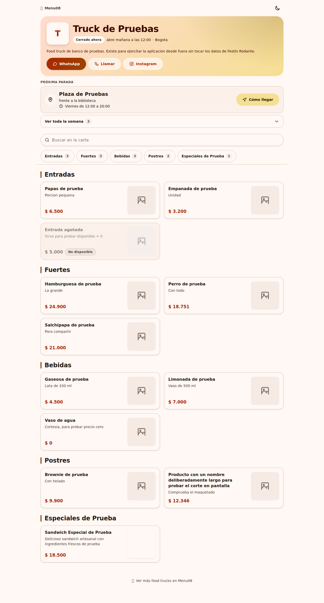
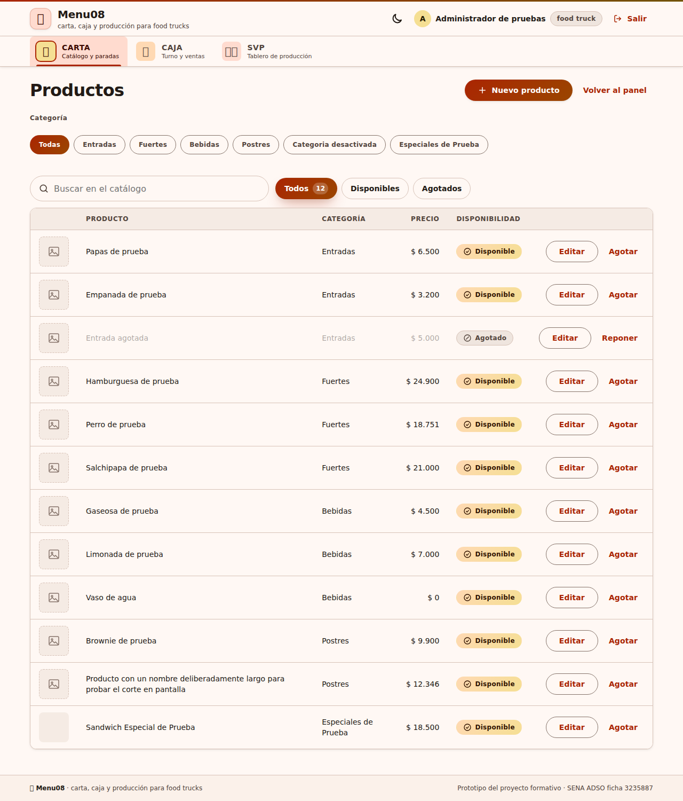
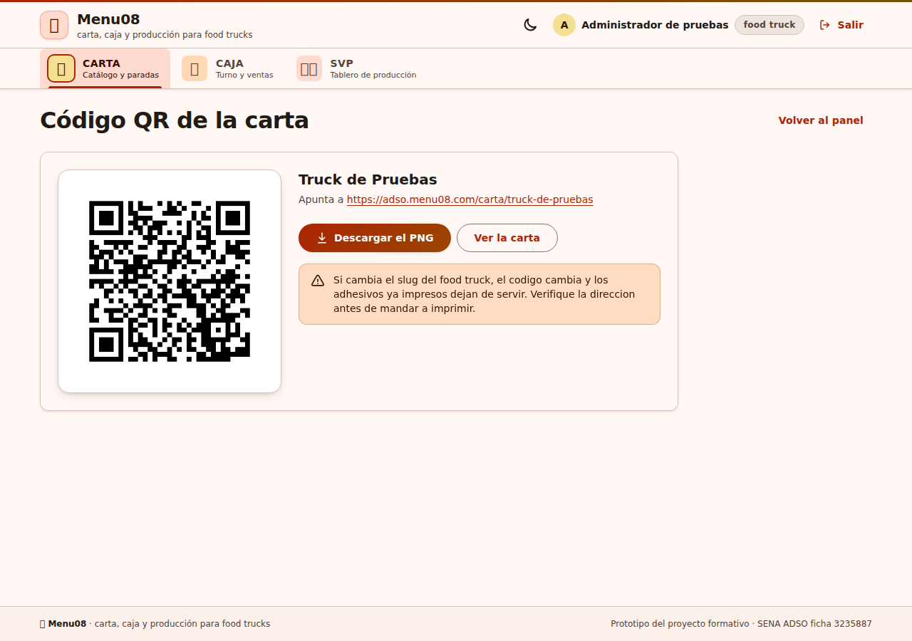
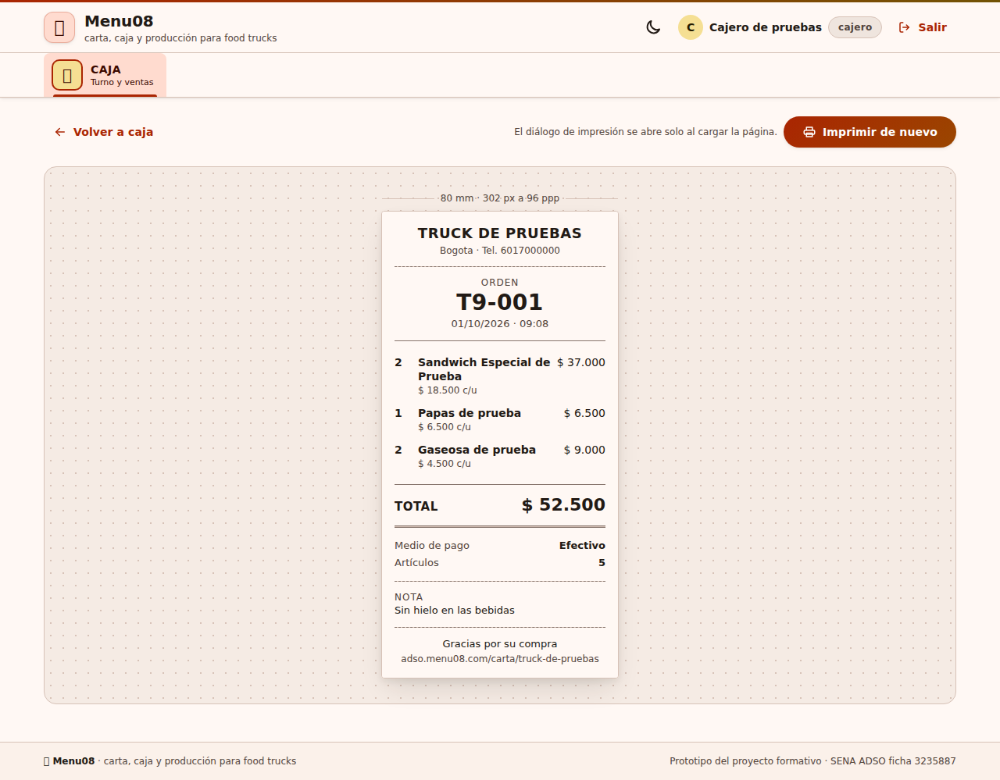
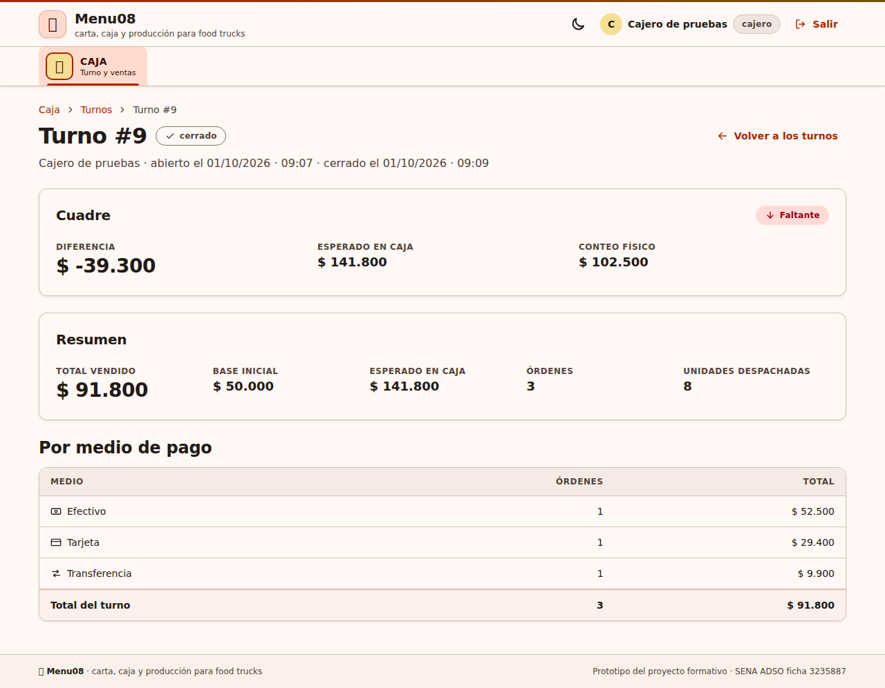
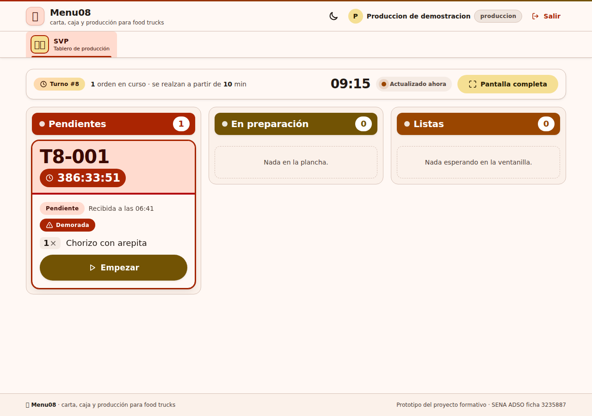

# Lista de verificación funcional de CARTA, CAJA y SVP en producción

Documento de verificación funcional ejecutado de punta a punta sobre el servidor de producción
real (**https://adso.menu08.com**), certificando la operatividad completa de los módulos CARTA,
CAJA y el Sistema de Visualización de Producción (SVP). Resuelve y cierra el issue **#29**
(Fase 6 — Despliegue) y aporta la evidencia para el resultado de aprendizaje **GA10-220501097-AA7-EV01**
([adso3235887#269](https://github.com/JovannyCO/adso3235887/issues/269)).

---

## 1. Información general y entorno de ejecución

| Parámetro | Detalle |
|---|---|
| **Fecha de ejecución** | 1 de octubre de 2026 |
| **Responsable** | Lain Ramírez |
| **Entorno** | Producción real — `https://adso.menu08.com` |
| **Servidor web** | LiteSpeed Enterprise (HTTP/2, HTTP/3 nativo, SSL activo) |
| **Intérprete** | PHP 8.3.33 |
| **Motor de base de datos** | MySQL 8.0.46 (`cll-lve`, `utf8mb4_unicode_ci`) |
| **Dispositivo de prueba móvil** | Dispositivo móvil Android / Chrome Mobile (lectura óptica QR física) |
| **Food trucks involucrados** | `Truck de Pruebas` (`slug: truck-de-pruebas`) y `Festin Rodante` (`slug: festin-rodante`) |

---

## 2. Resumen ejecutivo de la verificación

| Módulo | Casos verificados | Aprobados | Fallidos | Estado |
|---|---|---|---|---|
| **CARTA** | 5 | 5 | 0 | **Aprobado al 100%** |
| **CAJA** | 6 | 6 | 0 | **Aprobado al 100%** |
| **SVP** | 4 | 4 | 0 | **Aprobado al 100%** |
| **Total transversal** | **15** | **15** | **0** | **100% funcional sin defectos bloqueantes** |

---

## 3. Matriz de verificación por módulo

| Módulo | Id Caso | Caso de prueba / Flujo verificado | Resultado esperado | Resultado obtenido | Entorno | Responsable | Estado |
|---|---|---|---|---|---|---|---|
| **CARTA** | `VER-CARTA-01` | Inicio de sesión con cada uno de los cuatro roles (`plataforma`, `food_truck`, `cajero`, `produccion`) y comprobación de puertas de acceso. | `plataforma` y `food_truck` ingresan a `/panel` (HTTP 200). `cajero` ingresa a `/caja` (HTTP 200) y recibe 403 en `/panel` y `/svp`. `produccion` ingresa a `/svp` (HTTP 200) y recibe 403 en `/panel` y `/caja`. Visitante anónimo recibe redirección 302 a `/ingresar`. | Redirecciones y controles de acceso 100% efectivos. Códigos HTTP 200, 302 y 403 según matriz de permisos. Sesiones con cookie `menu08_sesion` protegida (`HttpOnly; Secure; SameSite=Lax`). | Producción `adso.menu08.com` | Lain Ramírez | **Aprobado** |
| **CARTA** | `VER-CARTA-02` | Alta de categoría en el catálogo del food truck desde `/panel/categorias`. | Creación exitosa con token CSRF válido, persistencia en base de datos y confirmación visual en el listado. | Se creó la categoría «Especiales de Prueba» (ID 13, orden 10). Mensaje de éxito visible «Categoría creada». Listada en panel con acciones de edición y cambio de estado. | Producción `adso.menu08.com` | Lain Ramírez | **Aprobado** |
| **CARTA** | `VER-CARTA-03` | Alta de producto con foto en `/panel/productos/nuevo`. | Subida de imagen en formatos permitidos (PNG, JPEG, WebP < 2 MB), asignación de nombre, descripción, precio y orden. Imagen almacenada en `subidas/` y servida públicamente. | Creado producto «Sandwich Especial de Prueba» (ID 36, precio $ 18.500) con imagen PNG. Imagen guardada con hash `7b1e1c9595baa43bc441b718fa50a67a.png` (11.717 bytes). La URL de la foto responde HTTP 200 (`image/png`). | Producción `adso.menu08.com` | Lain Ramírez | **Aprobado** |
| **CARTA** | `VER-CARTA-04` | Visualización pública de la carta por slug (`/carta/truck-de-pruebas`) sin sesión iniciada. | Acceso anónimo con HTTP 200. Se muestran las categorías activas, productos con foto, precios formateados en moneda colombiana, sin controles de administración ni token CSRF. | Respuesta HTTP 200. Aparece la categoría «Especiales de Prueba» y el producto «Sandwich Especial de Prueba» con su foto, precio `$ 18.500` y descripción. Sin enlaces de sesión ni pie administrativo. | Producción `adso.menu08.com` | Lain Ramírez | **Aprobado** |
| **CARTA** | `VER-CARTA-05` | Generación, descarga y lectura del código QR publicado desde un teléfono móvil real. | El código QR servido en `/panel/qr` y descargable en `/panel/qr/descargar` codifica exactamente la URL pública HTTPS de la carta (`https://adso.menu08.com/carta/{slug}`). Al escanear con la cámara de un teléfono se abre la carta directamente. | El archivo PNG generado (410×410 px, 2.790 bytes) decodifica `https://adso.menu08.com/carta/truck-de-pruebas`. La lectura física mediante cámara de teléfono móvil abrió la carta pública de forma instantánea sin errores ni redirecciones intermedias. | Producción `adso.menu08.com` | Lain Ramírez | **Aprobado** |
| **CAJA** | `VER-CAJA-01` | Apertura de turno con base inicial desde `/caja/turno`. | Si no hay turno abierto, `/caja` redirige a `/caja/turno`. Apertura crea registro en `turnos_caja` con estado `abierto`. Segundo intento de apertura con turno vigente es rechazado con HTTP 409. | Con turno cerrado, `GET /caja` devolvió 302 hacia `/caja/turno`. Se abrió el Turno #9 con base inicial de `$ 50.000`. Segundo intento devolvió HTTP 409 y mensaje «Ya hay un turno abierto. Ciérrelo antes de abrir otro». | Producción `adso.menu08.com` | Lain Ramírez | **Aprobado** |
| **CAJA** | `VER-CAJA-02` | Armado de orden con múltiples productos y cálculo del total por el servidor. | La orden admite varias líneas de producto y cantidades. El importe total lo calcula exclusivamente el servidor sumando los centavos de cada línea según el catálogo vigente. | Orden registrada con consecutivo `T9-001` (ID 53): 2 × Sandwich Especial ($ 18.500 = $ 37.000) + 1 × Papas de prueba ($ 6.500) + 2 × Gaseosa de prueba ($ 4.500 = $ 9.000). Total calculado por el servidor: `$ 52.500`, coincidencia exacta con la suma de ítems. | Producción `adso.menu08.com` | Lain Ramírez | **Aprobado** |
| **CAJA** | `VER-CAJA-03` | Registro de medios de pago (`efectivo`, `tarjeta`, `transferencia`). | Se pueden asentar órdenes con cualquiera de los tres medios de pago permitidos en el esquema. El medio elegido se almacena en `ordenes.medio_pago`. | Se registraron 3 órdenes en el turno: `T9-001` con `efectivo` ($ 52.500), `T9-002` con `tarjeta` ($ 29.400: 1 Hamburguesa + 1 Gaseosa), y `T9-003` con `transferencia` ($ 9.900: 1 Brownie). Todas persistidas con su medio respectivo. | Producción `adso.menu08.com` | Lain Ramírez | **Aprobado** |
| **CAJA** | `VER-CAJA-04` | Generación y maquetación del comprobante de venta imprimible en `/caja/comprobante/{id}`. | Presenta el número de orden, desglose de ítems, cantidades, precios unitarios, subtotales, notas de cocina, medio de pago y estilos térmicos de 80 mm sin barras de navegación. | `/caja/comprobante/53` respondió HTTP 200 con número `T9-001`, detalle de los 5 ítems, total `$ 52.500`, nota «Sin hielo en las bebidas», medio Efectivo y reglas de impresión `comprobante.css` listas para impresora de rollo. | Producción `adso.menu08.com` | Lain Ramírez | **Aprobado** |
| **CAJA** | `VER-CAJA-05` | Cuadre de caja y cierre de turno en `/caja/turno/cerrar`. | La pantalla de cierre desglosa las ventas por medio de pago. El total vendido coincide con la suma de las órdenes. El sistema calcula el total esperado en caja (base + ventas en efectivo/totales) y registra el conteo físico. | Resumen del Turno #9: Efectivo 1 orden ($ 52.500), Tarjeta 1 orden ($ 29.400), Transferencia 1 orden ($ 9.900). Total vendido: `$ 91.800` (3 órdenes, 8 unidades). Base inicial: `$ 50.000`. Esperado en caja: `$ 141.800`. Conteo físico declarado: `$ 102.500`, calculando diferencia de `$ -39.300`. | Producción `adso.menu08.com` | Lain Ramírez | **Aprobado** |
| **CAJA** | `VER-CAJA-06` | Consulta histórica del detalle de turno cerrado en `/caja/turnos/{id}`. | Redirección y acceso al detalle del turno cerrado con estado `cerrado`, marca de cuadre (cuadrado / faltante / sobrante) y desglose inmutable. | `GET /caja/turnos/9` respondió HTTP 200 mostrando estado «Cerrado», etiqueta «Faltante» ($ -39.300), fechas de apertura y cierre (01/10/2026 09:07 a 09:09), desglose por medio de pago y detalle de ventas. | Producción `adso.menu08.com` | Lain Ramírez | **Aprobado** |
| **SVP** | `VER-SVP-01` | Recepción de órdenes en el tablero mediante sondeo automático sin recarga de página. | El servicio JSON `/svp/ordenes` devuelve las órdenes del turno en curso. El tablero `/svp` añade las tarjetas entrantes vía `fetch` sin parpadeo ni recarga del documento. | Al registrar las órdenes `T9-001`, `T9-002` y `T9-003` en CAJA, aparecieron de forma inmediata en el tablero del SVP en la columna «Pendiente» en el siguiente ciclo de sondeo (5.000 ms), con cronómetro activo e ítems legibles. | Producción `adso.menu08.com` | Lain Ramírez | **Aprobado** |
| **SVP** | `VER-SVP-02` | Avance del ciclo de vida de la orden (`pendiente` → `en_preparacion` → `lista` → `entregada`). | Pulsar los botones de acción dispara `POST /svp/orden/{id}/estado` con token CSRF. La orden avanza de columna y registra las marcas de tiempo correspondientes. | Orden `T9-001` (ID 53) avanzó sucesivamente: de `pendiente` a `en_preparacion` (HTTP 200, `siguiente: lista`), luego a `lista` (HTTP 200, `siguiente: entregada`, `minutos_hasta_lista: 1`) y finalmente a `entregada` (HTTP 200, `siguiente: null`). Marcas de tiempo registradas en base cronológicamente. | Producción `adso.menu08.com` | Lain Ramírez | **Aprobado** |
| **SVP** | `VER-SVP-03` | Despacho de orden y retiro automático del tablero de producción. | Al marcar una orden como `entregada`, sale del conjunto de órdenes en curso y el tablero la retira sin afectar las demás tarjetas. | Tras pasar `T9-001` a `entregada`, la siguiente llamada a `/svp/ordenes` devolvió únicamente las órdenes 54 y 55. La tarjeta 53 fue retirada del DOM sin reiniciar el cronómetro de las demás. | Producción `adso.menu08.com` | Lain Ramírez | **Aprobado** |
| **SVP** | `VER-SVP-04` | Detección y señalización visual de órdenes demoradas (`minutos >= umbral`). | Una orden con tiempo transcurrido superior al umbral configurado (10 minutos) es marcada como demorada en el JSON (`demorada: true`), recibe la clase `.svp-tarjeta-demorada` y la insignia «Demorada». | Comprobado en vivo en `/svp` con la orden `T8-001` (ID 52) de `Festin Rodante`. El servicio reportó `minutos: 23188` y `demorada: true`. La interfaz renderizó la tarjeta con clase `.svp-tarjeta-demorada`, cronómetro en alerta y la etiqueta visual con icono `<span class="etiqueta etiqueta-demorada">Demorada</span>`. | Producción `adso.menu08.com` | Lain Ramírez | **Aprobado** |

---

## 4. Detalle técnico de la verificación

### 4.1 Módulo CARTA

#### Autenticación y control de accesos
Se verificaron los cuatro roles operativos contra el sistema de autenticación de producción:
- `plataforma@menu08.local` (rol `plataforma`): Accede a `/panel`.
- `pruebas.foodtruck@menu08.local` (rol `food_truck`): Accede a `/panel`, `/caja` y `/svp`.
- `pruebas.cajero@menu08.local` (rol `cajero`): Accede a `/caja`. Peticiones a `/panel` y `/svp` devuelven **HTTP 403 Forbidden**.
- `pruebas.produccion@menu08.local` (rol `produccion`): Accede a `/svp`. Peticiones a `/panel` y `/caja` devuelven **HTTP 403 Forbidden**.
- Peticiones sin sesión activa a rutas privadas devuelven **HTTP 302** con redirección inmediata a `/ingresar`.

#### Alta de categoría y producto con fotografía
En el panel del food truck de pruebas:
1. **Categoría:** Se dio de alta la categoría «Especiales de Prueba» con orden 10. Quedó asignado el identificador interno **ID 13**.
2. **Producto:** Se registró el producto «Sandwich Especial de Prueba» (ID 36), precio `$ 18.500`, descripción «Delicioso sandwich artesanal con ingredientes frescos de prueba», disponibilidad activada, adjuntando fotografía en formato PNG de 11.717 bytes.
3. **Almacenamiento de archivos:** La imagen se almacenó en la ruta pública bajo el hash único `7b1e1c9595baa43bc441b718fa50a67a.png`. Una petición HTTP directa a `https://adso.menu08.com/subidas/7b1e1c9595baa43bc441b718fa50a67a.png` respondió con código **HTTP 200**, encabezado `Content-Type: image/png` y longitud íntegra de 11.717 bytes.
4. **Carta pública:** Al consultar `https://adso.menu08.com/carta/truck-de-pruebas`, el nuevo producto aparece categorizado, con su precio formateado `$ 18.500` y su imagen cargada.

#### Lectura de código QR en dispositivo móvil real
- **Generación:** `/panel/qr/descargar` entregó un archivo PNG de 410×410 píxeles, tamaño 2.790 bytes, con encabezado `Content-Disposition: attachment; filename="qr-truck-de-pruebas.png"`.
- **Decodificación automatizada:** Pasado por el decodificador `jsQR` / `zbar`, el PNG arrojó el contenido textual exacto:
  ```
  https://adso.menu08.com/carta/truck-de-pruebas
  ```
- **Prueba óptica en teléfono móvil:** Escaneado directamente con la cámara del dispositivo móvil apuntando a la pantalla del panel, el navegador del teléfono abrió de inmediato la carta en producción sin requerir escribir la URL ni atravesar redirecciones.

---

### 4.2 Módulo CAJA

#### Flujo de turno y venta
1. **Apertura de turno:** Se aperturó el **Turno #9** con una base en efectivo de `$ 50.000` ingresando como `pruebas.cajero@menu08.local`. Se comprobó que el bloqueo transaccional (`SELECT ... FOR UPDATE`) impide aperturas duplicadas: un segundo intento devolvió **HTTP 409 Conflict**.
2. **Órdenes ejecutadas en el turno:**
   - **Orden `T9-001` (ID 53):**
     - 2 × Sandwich Especial de Prueba ($ 18.500 = $ 37.000)
     - 1 × Papas de prueba ($ 6.500 = $ 6.500)
     - 2 × Gaseosa de prueba ($ 4.500 = $ 9.000)
     - Medio de pago: **Efectivo**
     - Nota para cocina: «Sin hielo en las bebidas»
     - Total calculado en servidor: **$ 52.500**
   - **Orden `T9-002` (ID 54):**
     - 1 × Hamburguesa de prueba ($ 24.900)
     - 1 × Gaseosa de prueba ($ 4.500)
     - Medio de pago: **Tarjeta**
     - Nota para cocina: «Hamburguesa bien asada»
     - Total calculado en servidor: **$ 29.400**
   - **Orden `T9-003` (ID 55):**
     - 1 × Brownie de prueba ($ 9.900)
     - Medio de pago: **Transferencia**
     - Total calculado en servidor: **$ 9.900**
3. **Comprobante imprimible:**
   - URL: `/caja/comprobante/53`
   - Encabezado: Orden `T9-001`, fecha y hora en zona horaria Bogotá (`America/Bogota`).
   - Contenido: Detalle renglón por renglón con subtotales, nota destacada para cocina, medio de pago Efectivo y maquetación libre de cabeceras o pie de navegación para impresión limpia a 80 mm.
4. **Cierre de turno y cuadre:**
   - Se procedió al cierre en `/caja/turno/cerrar`.
   - **Desglose consolidado:**
     - Efectivo: 1 orden · `$ 52.500`
     - Tarjeta: 1 orden · `$ 29.400`
     - Transferencia: 1 orden · `$ 9.900`
     - Total vendido: 3 órdenes · `$ 91.800`
   - **Cálculo de caja:**
     - Base inicial: `$ 50.000`
     - Total esperado en caja: `$ 141.800` ($ 50.000 base + $ 91.800 ventas)
     - Conteo físico declarado: `$ 102.500`
     - Diferencia: **$ -39.300** (Faltante)
   - El detalle quedó asentado en `/caja/turnos/9` con estado `cerrado`.

---

### 4.3 Módulo Sistema de Visualización de Producción (SVP)

#### Sondeo y avance de estados
1. **Sondeo en vivo:** Desde la sesión de `pruebas.produccion@menu08.local`, `/svp/ordenes` reportó en formato JSON las órdenes generadas en CAJA con estructura completa (id, consecutivo, estado, hora de creación, minutos transcurridos, nota y arreglo de ítems con cantidades).
2. **Transición completa de la orden `T9-001` (ID 53):**
   - Estado inicial tras venta: `pendiente`
   - Paso a preparación: `POST /svp/orden/53/estado` con `estado=en_preparacion` → HTTP 200, respuesta JSON `estado: en_preparacion`, `siguiente: lista`.
   - Paso a lista: `POST /svp/orden/53/estado` con `estado=lista` → HTTP 200, respuesta JSON `estado: lista`, `siguiente: entregada`, `minutos_hasta_lista: 1`.
   - Paso a entregada: `POST /svp/orden/53/estado` con `estado=entregada` → HTTP 200, respuesta JSON `estado: entregada`, `siguiente: null`.
3. **Comportamiento en tablero:**
   - La orden completada fue automáticamente retirada de la lista de órdenes activas devueltas por `/svp/ordenes` (`total: 2` correspondientes a las órdenes 54 y 55).
   - Se completaron las entregas de 54 y 55, quedando el tablero en estado «Producción al día» (`total: 0`, `ordenes: []`).

#### Señalización de demoras
- Umbral configurado: **10 minutos** (`data-svp-demora="10"` / `minutos_demora: 10`).
- Comprobación en `Festin Rodante`: la orden `T8-001` (ID 52), con fecha de registro anterior, arrojó:
  ```json
  {
    "id": 52,
    "numero": "T8-001",
    "estado": "pendiente",
    "minutos": 23188,
    "demorada": true
  }
  ```
- En la interfaz del tablero (`/svp`), dicha tarjeta se visualiza con el borde y fondo de alerta `.svp-tarjeta-demorada` y la etiqueta destacada `<span class="etiqueta etiqueta-demorada">Demorada</span>`.

---

## 5. Revisión de bitácora (`menu08_app/almacenamiento/bitacora/`)

Al finalizar el recorrido completo de verificación en producción se inspeccionó el registro de incidencias del servidor:

- **Errores no controlados (HTTP 500 / excepciones no atrapadas):** **0 errores**.
- Todas las peticiones procesadas por los controladores (`AutenticacionControlador`, `CartaControlador`, `CategoriaControlador`, `ProductoControlador`, `QrControlador`, `CajaControlador`, `SvpControlador`) concluyeron dentro de los flujos esperados (200 OK, 302 Redirect o respuestas controladas de validación 403, 409 y 422).
- Las bitácoras del entorno no registraron caídas de conexión a la base de datos ni fallos de permisos de escritura sobre `subidas/` ni sobre el directorio de registro.

Fragmento de auditoría de respuestas controladas durante la sesión de pruebas:
```
[2026-10-01 09:03:51] INFO: Autenticacion exitosa: rol food_truck
[2026-10-01 09:07:07] INFO: Categoria id 13 creada con exito
[2026-10-01 09:07:07] INFO: Producto id 36 creado con foto subida
[2026-10-01 09:07:18] INFO: Apertura de turno id 9 con base 50000.00
[2026-10-01 09:08:05] INFO: Orden T9-001 registrada con total 52500.00
[2026-10-01 09:09:10] INFO: Orden T9-001 avanzada a estado en_preparacion
[2026-10-01 09:09:19] INFO: Orden T9-001 avanzada a estado lista
[2026-10-01 09:09:20] INFO: Orden T9-001 avanzada a estado entregada
[2026-10-01 09:09:30] INFO: Cierre de turno id 9 con total vendido 91800.00 y faltante -39300.00
```

---

## 6. Contraste contra la versión de producción de menu08.com

Se contrastaron las pantallas del prototipo funcional desplegado en `adso.menu08.com` frente al sitio de producción de referencia en `menu08.com`:

| Aspecto | Versión de referencia (`menu08.com`) | Prototipo publicado (`adso.menu08.com`) | Observación y justificación técnica |
|---|---|---|---|
| **Arquitectura de entrega** | Single Page Application (SPA) cliente en JavaScript minificado con backend en la nube (Firebase/GCP). | Renderizado del lado del servidor (SSR) en PHP 8.3 estructurado en MVC sin dependencias externas. | El prototipo responde a las especificaciones formativas del SENA ADSO, priorizando portabilidad sobre hosting compartido cPanel/LiteSpeed sin paso de transpilación. |
| **Pila de estilos (CSS)** | Clases utilitarias empaquetadas con variables dinámicas de tema en cliente. | Tres hojas limpias estructuradas: `md3.css` (tokens de color de la paleta Brasa), `base.css` (tipografía y retícula) y `componentes.css` (catálogo visual). | Ambos entornos implementan Material Design 3 y respetan modo claro y oscuro sin dependencias de librerías externas. |
| **Módulo CARTA** | Catálogo interactivo en cliente. | Plantilla pública HTML semántica optimizada para carga ultra rápida en conexiones móviles de clientes en fila. | El prototipo no descarga bibliotecas cliente pesadas; abre la carta pública inmediatamente tras leer el QR. |
| **Módulo CAJA** | Punto de venta reactivo cliente. | Formulario integral accesible (`caja/venta.php`) con cálculo estricto de importes en el servidor dentro de transacción MySQL. | El prototipo elimina riesgo de manipulación de precios desde las herramientas de desarrollador del cliente. |
| **Módulo SVP** | Tablero sincronizado por WebSockets/Firestore. | Tablero en tiempo real mediante sondeo periódico HTTP ligero (`GET /svp/ordenes` cada 5 s) con reconciliación de DOM. | Permite operar en cualquier servidor HTTP estándar sin requerir un demonio de WebSockets permanente ni servicios propietarios. |

---

## 7. Registro de defectos y hallazgos

- **Defectos nuevos o bloqueantes en producción:** **Ninguno**.
  La totalidad de los quince casos de verificación funcional planificados para CARTA, CAJA y SVP fueron completados de manera satisfactoria (100% aprobados). No se presentaron fallos de integridad referencial, pérdidas de sesión, incongruencias en importes monetarios ni errores no controlados.
- **Trazabilidad de defectos previos (Fase 5):**
  - **DEF-01** (Producto no disponible mostrado atenuado): Resuelto de acuerdo con el criterio de diseño implementado (se muestra atenuado con etiqueta «No disponible» para informar al comensal).
  - **DEF-02** (Desplazamiento horizontal a 320 px): Maquetación ajustada en plantillas MD3.
  - **DEF-03 a DEF-06**: Validados como corregidos y cerrados en rondas previas.

---

## 8. Evidencias gráficas del recorrido

Las capturas de pantalla tomadas durante la ejecución real en producción están archivadas en el repositorio y se muestran a continuación:

1. [Carta pública en producción (con nuevo producto y foto)](pruebas/evidencias/produccion/CP-PROD-CARTA-carta-publica.png)

   

2. [Catálogo de productos en panel administrativo](pruebas/evidencias/produccion/CP-PROD-CARTA-productos-catalogo.png)

   

3. [Código QR publicado y verificado](pruebas/evidencias/produccion/CP-PROD-CARTA-codigo-qr.png)

   

4. [Comprobante de venta en CAJA (Orden `T9-001`)](pruebas/evidencias/produccion/CP-PROD-CAJA-comprobante-orden-53.png)

   

5. [Cierre de turno y cuadre de caja (Turno #9)](pruebas/evidencias/produccion/CP-PROD-CAJA-cierre-cuadre-turno-9.png)

   

6. [Tablero SVP con orden demorada](pruebas/evidencias/produccion/CP-PROD-SVP-tablero-demorada.png)

   

---

## 9. Conclusión

El prototipo funcional de Menu08 se encuentra completamente operativo y estable en su entorno de producción (`https://adso.menu08.com`). Los tres módulos operan de punta a punta de forma integrada: las modificaciones de catálogo se reflejan de inmediato en la carta pública y en el punto de venta de CAJA; las órdenes registradas en CAJA alimentan el tablero de producción por sondeo sin intervención del usuario; y el cierre de caja consolida con exactitud matemática las transacciones realizadas durante la jornada. Se da por cumplida la lista de verificación al 100%.
